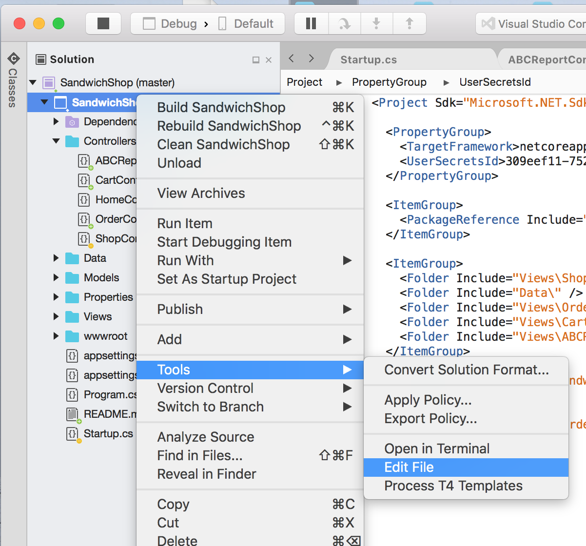
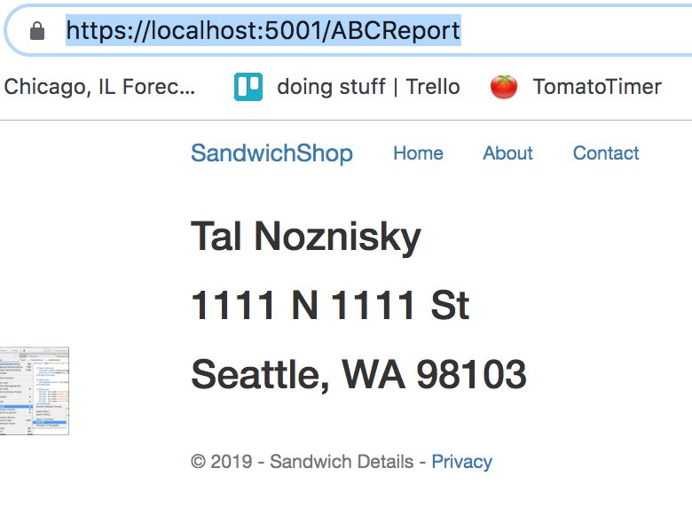

# Sandwich Shop

Sandwich Shop is an ecommerce platform that allows users to get quick and delectable
delivery sandwiches from the comfort of their own sandwichlessness.

## How to start up Sandwich Shop
These instructions will guide you through starting a development version of Sandwich Shop. The tutorial
goes only as far as previewing a mock order address for the receipt module.

* Fork this repo and clone it your local machine.
* Open the the project folder in Visual Studio.
* Add configure database connection, using the following instructions:  
  - In the Solution Explorer, `control + click` on the SandwichSop solution file, expand the Tools option, and open the project configuration XML by selecting Edit File.
  

  - Confirm that a `<UserSecretsId>` exists in the `<PropertyGoup>` node. If it does not, add the following:
    ```
    <UserSecretsId>[a-randomly-generated-GUID]</UserSecretsId>
    ```
  - In your terminal, navigate to the `sandwich-shop` project folder
  - Add the DB connection string to your Users Secrets file thusly:
    ```
    dotnet user-secrets set 'ABCConnectionString' 'Data Source=127.0.0.1;Initial Catalog=ABC;User ID=[userid];Password=[password];Connect Timeout=30;Encrypt=False;TrustServerCertificate=False;ApplicationIntent=ReadWrite;MultiSubnetFailover=False'
    ```
  - If the connection string is accepted and added to the secrets file, you should see the following message in the console:
    ```
    Successfully saved ABCConnectionString = Data Source=127.0.0.1;Initial Catalog=ABC;User ID=[userid];Password=[password];Connect Timeout=30;Encrypt=False;TrustServerCertificate=False;ApplicationIntent=ReadWrite;MultiSubnetFailover=False to the secret store.
    ```
  - To valid the connection, build and run the code in VS.
  - Navigate your browser to `https://localhost:5001/ABCReport`, which triggers the SQL report controller and view. You should see mock data rendered to the page thusly:
  
